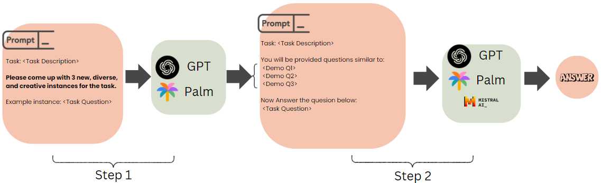

# Unsupervised Self-ICL: LLMs Do Not Need Demonstration Labels

This is the repository of our paper [Unsupervised Self-ICL: LLMs Do Not Need Demonstration Labels]

Using Unsupervised ICL, LLMs are used to generate only the pseudo-question component of the demonstration, without the corresponding answers, hence mitigating the risk of introducing errors that occur through potentially inaccurate answers




---

This repository builds on code from the following work. If you this repository, please cite their work as well:
This is the official repository of our paper [Self-ICL: Zero-Shot In-Context Learning with Self-Generated Demonstrations](https://arxiv.org/pdf/2305.15035.pdf), *EMNLP* 2023.


## Steps to Reproduce Experiments
To reproduce proprietary LLM Experiments, follow the instructions below

### Setup API Keys
Set the environment variables to your API keys. For example, `GOOGLE_API_KEY` for PaLM-2, and `OPENAI_API_KEY` for GPT models.
```
export GOOGLE_API_KEY=<your_api_key>
```

### Configure the Experiment Settings
Set the configuration file in `./configs` to your experiment settings. For example, the `configs/config_template_up-self-icl.yml` file contains the settings to run **Unsupervised ICL** on GPT-3.5.

### Run the Prompting Script
To run the experiment, use the following command:
```
python experiment.py --config_path ./configs/config_template_up-self-icl.yml --label_type "class"
```

### Run the Evaluation Script
To evaluate the results:
```
python experiment.py --config_path ./configs/config_template_up-self-icl.yml --label_type "class" --eval
```

## Steps to Reproduce Mistral Experiments
To reproducde experiments on Mistral-7B-Instruct, you must first run a GPT-3.5 experiment from above, as this experiment repurposes generated demonstrations from GPT-3.5 for Self-ICL and Unsup. Self-ICL


### Run the Evaluation Script
To evaluate the results:
```
accelerate launch --num_processes 1  prompt-hf.py --config_path ./configs/self-icl.hf.yml --label_type "class" --input_dir <log directory generated by GPT-3.5>
```
***This experiment is designed to run on a GPU***
